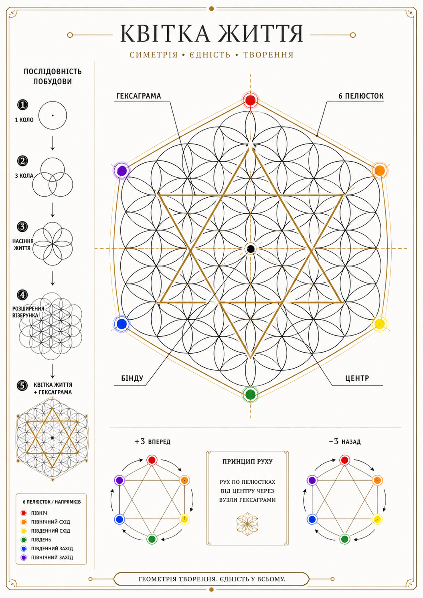

# Vuzol-19 Book Runtime v0.2

- `center_bindu/01_FLOWER_RUNTIME_TABLES.md` — руни, кольори, пелюстки, рух сцен, живий світ.
- `center_bindu/03_PETAL_MANIFEST.yaml` — машинно-читабельні ролі пелюсток і правила блокування.
# Vuzol-19 Book Kernel

A flower-based runtime canon for writing the novel **Vuzol-19**.

This repository is not just a book outline.  
It is a scene-runtime system for AI-assisted writing:

Signal → Flower Scan → +3 Forward → -3 Backward → Bindu Verdict → Scene Draft → Anti-PRION Audit → Memory Update.

Core law:

> Not every intent has the right to become action.
