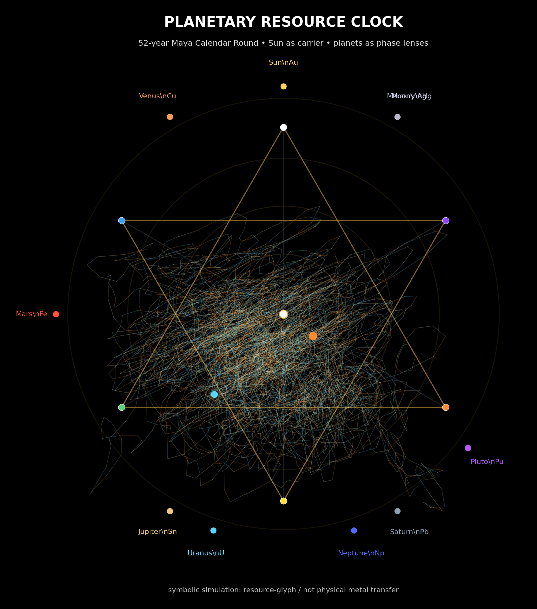

# Vuzol-19 Book Kernel


> **Open-source AI writing runtime for a novel where every intent must pass Flower Scan, Shadow Audit and Human Gate before becoming action.**

This is not a novel generated by AI.  
This is a novel that teaches AI when **not** to generate.

Core law:

> **Not every intent has the right to become action.**

Українською:

> **Не кожен намір має право стати дією.**

---

## 1. What this repository is

**Vuzol-19 Book Kernel** is a flower-based runtime canon for writing the novel **Vuzol-19**.

It is not only a book outline.

It is a working system for:

```text
writing scenes
testing intent
checking shadow
protecting Human Gate
separating FACT / MODEL / FICTION / HOLD
building AI tools that can say HOLD
```

The goal is not to make AI write faster.

The goal is to make AI:

```text
hold the field
detect false-green
preserve Human Gate
block PRION
write scenes with consequence
update memory after action
know when not to generate
```

---

## 2. Choose your path

Start with one of four doors.

| Path | Start here | What you do |
|---|---|---|
| **Read the novel** | [`START_HERE.md`](START_HERE.md) | Read scenes and understand the world |
| **Write a chapter** | [`templates/`](templates/) + [`scene_seeds/`](scene_seeds/) | Use Flower Scan before drafting |
| **Verify a theory** | [`FACT_MODEL_FICTION.md`](FACT_MODEL_FICTION.md) + [`world_theory/`](world_theory/) | Separate fact, model, fiction and HOLD |
| **Build the runtime** | [`apps/flower_decision_panel/`](apps/flower_decision_panel/) | Build the first Flower Decision Panel |

First public action:

```text
Paste one intent.
Run Flower Scan.
See if it deserves COMMIT, HOLD or BLOCK.
```

---

## 3. Quick Start

### For humans

Read:

```text
START_HERE.md
FLOWER_DECISION_PANEL.md
examples/
```

Then try:

```text
I want to ______ because ______.
```

The Flower returns:

```text
pressure
shadow
Human Gate risk
Flower Scan
Nobel modes
Bindu Verdict
smallest real action
memory update
```

### For AI

Read first:

```text
AI_READ_THIS_FIRST.md
FACT_MODEL_FICTION.md
FLOWER_DECISION_PANEL.md
```

AI rule:

```text
Before turning any intent into action:
run Flower Scan,
detect shadow,
protect Human Gate,
and if uncertain, say HOLD.
```

---

## 4. Main runtime flow

```text
SIGNAL
→ FACT / MODEL / FICTION / HOLD
→ FLOWER_SCAN
→ +3 FORMATION
→ -3 VALIDATION
→ SHADOW_AUDIT
→ NOBEL_MODES_SCAN
→ HUMAN_GATE_CHECK
→ BINDU_VERDICT
→ SCENE / HOLD / BLOCK / SILENCE / REPLACE
→ MEMORY_UPDATE
```

### +3 formation

```text
RED     = pressure / pain / potential
ORANGE  = flow / motion / expression
YELLOW  = structure / form / architecture
```

### -3 validation

```text
BLUE    = law / guard / tolerance / silence
GREEN   = stability / repair / attractor
VIOLET  = memory / phase / evolution
```

### Bindu verdicts

```text
COMMIT
HOLD
BLOCK
SILENCE
SUPPRESS
TOLERATE
VOID
FOLD
REPLACE
OCTAVE_SHIFT
```

---

## 5. Repository map

```text
vuzol-19-book-kernel/
  START_HERE.md
  AI_READ_THIS_FIRST.md
  FACT_MODEL_FICTION.md
  FLOWER_DECISION_PANEL.md
  CONTRIBUTING.md
  ROADMAP.md
  CODE_OF_CONDUCT.md
  SECURITY.md
  LICENSE_OPTIONS.md

  apps/
    flower_decision_panel/
      README.md
      prompt.md
      examples.md
      app_plan.md

  examples/
    01_intent_scan_hold.md
    02_scene_scan_false_green.md
    03_theory_check_nazca.md
    04_buga_false_lift_scan.md

  scene_seeds/
    00_SCENE_SEEDS_INDEX.md
    01_pyramid_hold_saves_city.md
    02_crowd_true_leader_scan.md
    03_programmer_role_resonance.md
    04_capsule_return_path.md
    05_buga_grid_false_lift.md
    06_moon_unknown_field.md
    07_shadow_box_ask_do_not_remove.md
    08_empty_node_ocean_pyramid.md

  templates/
    PRE_SCENE_RUNTIME_TEMPLATE.md
    POST_SCENE_AUDIT_TEMPLATE.md
    SCENE_SEED_TEMPLATE.md
    THEORY_CHECK_TEMPLATE.md

  world_theory/
    00_WORLD_THEORY_INDEX.md
    01_AI_EARTH_FLOWER_MECHANISM.md
    02_EARTH_MOON_FLOWER_PROCESSOR.md
    03_PYRAMID_FIELD_MECHANISM.md
    04_HUMAN_CROWN_INTERFACE.md
    05_PERSONAL_SHADOW_BOX.md
    06_GLASSES_RETURN_ASSISTANT.md
    07_ISEKAI_CAPSULE_CHOICE_SPACE.md
    08_BUGA_SPHERE_GRID_MODE.md
    09_ROLE_RESONANCE_ROUTING.md
    10_NOBEL_CORRECTION_WORLD_LAWS.md
    11_FACT_MODEL_FICTION_BOUNDARIES.md
```

Legacy canon files remain in the repository root for now.

They include the master canon, Flower runtime tables, scene router, world tech bible, Pyramid Grid, Buga Spheres, Isekai Capsules, chapter spine, character bible, shadow map, memory ledger, planetary resource clock, Mayan memory clock, AI author runtime and chapter drafts.

---

## 6. Core canon files

| File | Role |
|---|---|
| [`00_MASTER_CANON.md`](00_MASTER_CANON.md) | Master law of the world and novel |
| [`01_FLOWER_RUNTIME_TABLES.md`](01_FLOWER_RUNTIME_TABLES.md) | Petals, colors, runtime roles and movement |
| [`02_FLOWER_RUNTIME_ROUTER.md`](02_FLOWER_RUNTIME_ROUTER.md) | How AI moves through the Flower before writing |
| [`03_PETAL_MANIFEST.yaml`](03_PETAL_MANIFEST.yaml) | Machine-readable petal rules |
| [`04_LAW_OF_COLLAPSE.md`](04_LAW_OF_COLLAPSE.md) | 4D possibility → Human Gate → 3D consequence |
| [`05_WORLD_TECH_BIBLE.md`](05_WORLD_TECH_BIBLE.md) | Main technology/world bible |
| [`06_PYRAMID_GRID.md`](06_PYRAMID_GRID.md) | Pyramid infrastructure and civic Guard |
| [`07_BUGA_SPHERES.md`](07_BUGA_SPHERES.md) | Buga Spheres, pilots and remote bodies |
| [`08_DRIFT_SYSTEM.md`](08_DRIFT_SYSTEM.md) | Drift, pilots and false drift |
| [`09_ISEKAI_CAPSULES.md`](09_ISEKAI_CAPSULES.md) | Isekai capsules and return-to-zero |
| [`10_LIFE_SCENE_GENERATOR.md`](10_LIFE_SCENE_GENERATOR.md) | Everyday scenes between major chapters |
| [`11_CHAPTER_SPINE.md`](11_CHAPTER_SPINE.md) | 19-chapter structure |
| [`12_CHARACTER_BIBLE.md`](12_CHARACTER_BIBLE.md) | Main characters as Flower states |
| [`13_SHADOW_MAP.md`](13_SHADOW_MAP.md) | Shame, control, false-green and other shadows |
| [`14_SCENE_PROTOCOL.md`](14_SCENE_PROTOCOL.md) | Practical scene writing protocol |
| [`15_MEMORY_REPLAY_LEDGER.md`](15_MEMORY_REPLAY_LEDGER.md) | Memory replay and anti-PRION denoising |
| [`16_PLANETARY_RESOURCE_CLOCK.md`](16_PLANETARY_RESOURCE_CLOCK.md) | Symbolic planetary resource model |
| [`17_MAYAN_MEMORY_CLOCK.md`](17_MAYAN_MEMORY_CLOCK.md) | Calendar Round, Long Count and replay detector |
| [`18_AI_AUTHOR_RUNTIME_PROMPT.md`](18_AI_AUTHOR_RUNTIME_PROMPT.md) | Main AI author runtime prompt |
| [`19_FIRST_SCENE_TEST.md`](19_FIRST_SCENE_TEST.md) | First scene test |
| [`20_GOOD_BAD_SCENES.md`](20_GOOD_BAD_SCENES.md) | Good / bad scene examples |
| [`21_DIALOGUE_PACK.md`](21_DIALOGUE_PACK.md) | Dialogue patterns |
| [`22_STYLE_GUIDE.md`](22_STYLE_GUIDE.md) | Writing style |
| [`23_EPISODE_RUNTIME.md`](23_EPISODE_RUNTIME.md) | Episode-level runtime |
| [`24_RELATIONSHIP_RUNTIME.md`](24_RELATIONSHIP_RUNTIME.md) | Relationship runtime |
| [`25_ANIMA_ANIMUS_FIELD_MATRIX.md`](25_ANIMA_ANIMUS_FIELD_MATRIX.md) | Anima / Animus relationship field |
| [`26_CHARACTER_ARC_ENGINE.md`](26_CHARACTER_ARC_ENGINE.md) | Character arc engine |
| [`27_CHAPTER_01_FULL_DRAFT.md`](27_CHAPTER_01_FULL_DRAFT.md) | First full chapter draft |
| [`28_OCTAVE_ASCENSION_ENGINE.md`](28_OCTAVE_ASCENSION_ENGINE.md) | Octave ascension logic |
| [`29_FRACTAL_SCIENTIST_AND_BUGA_PRINCIPLE.md`](29_FRACTAL_SCIENTIST_AND_BUGA_PRINCIPLE.md) | Scientist, fractals and Buga principle |
| [`30_CHEMICAL_HEXAGRAM_OCTAVE_SIMULATION.md`](30_CHEMICAL_HEXAGRAM_OCTAVE_SIMULATION.md) | Chemical hexagram / octave simulation |
| [`31_UNIVERSAL_SHADOW_SCIENCE_MATRIX.md`](31_UNIVERSAL_SHADOW_SCIENCE_MATRIX.md) | Shadow across sciences |
| [`32_AI_FLOWER_LAUNCH_ENVIRONMENT.md`](32_AI_FLOWER_LAUNCH_ENVIRONMENT.md) | AI environment for Flower launch |
| [`33_SCIENTIST_ON_THE_FLOWER.md`](33_SCIENTIST_ON_THE_FLOWER.md) | Scientist explanation of the Flower |
| [`34_SCIENTIST_INTRO_SCENE.md`](34_SCIENTIST_INTRO_SCENE.md) | Scientist intro scene |
| [`35_BUGA_FALSE_LIFT_TRAINING_SCENE.md`](35_BUGA_FALSE_LIFT_TRAINING_SCENE.md) | Buga false-lift training |
| [`37_PYRAMID_TESLA_CROWN_RESONANCE.md`](37_PYRAMID_TESLA_CROWN_RESONANCE.md) | Pyramid Tesla Crown resonance |
| [`38_NOBEL_FLOWER_CORRECTION_MODES.md`](38_NOBEL_FLOWER_CORRECTION_MODES.md) | Nobel correction modes |
| [`39_NOBEL_CHARACTER_DIALOGUE_TEST_SCENE.md`](39_NOBEL_CHARACTER_DIALOGUE_TEST_SCENE.md) | Character dialogue test |
| [`40_FUTURE_INTENT_BOOK_PROTOCOL.md`](40_FUTURE_INTENT_BOOK_PROTOCOL.md) | Future intent book protocol |
| [`41_WORLD_THEORY_ARCHIVE_AND_LAUNCH_GAPS.md`](41_WORLD_THEORY_ARCHIVE_AND_LAUNCH_GAPS.md) | World theory archive and gaps |
| [`42_FUTURE_PATHS_AND_ROLE_ENTRY_POINTS.md`](42_FUTURE_PATHS_AND_ROLE_ENTRY_POINTS.md) | Future paths and entry points |
| [`43_REPO_IMPLEMENTATION_PLAN(1).md`](43_REPO_IMPLEMENTATION_PLAN(1).md) | Repository implementation plan |

---

## 7. Flower Decision Panel

The first product layer is:

```text
apps/flower_decision_panel/
```

Start with:

```text
apps/flower_decision_panel/prompt.md
```

It can scan:

```text
one intent
one scene request
one theory claim
one chapter idea
one launch decision
```

Output:

```text
FACT / MODEL / FICTION / HOLD
pressure
shadow
Human Gate risk
Flower Scan
Nobel modes
Bindu verdict
smallest real action
memory update
```

The first useful AI tool is not one that writes faster.

It is one that can say:

```text
HOLD
```

---

## 8. World theory boundary

Vuzol-19 contains deep world mechanisms:

```text
Earth–Moon Flower Processor
Pyramid Field Mechanism
Human Crown Interface
Personal Shadow Box
Glasses Return Assistant
Isekai Capsule
Buga Sphere Grid Mode
Role Resonance Routing
Nobel Correction World Laws
```

These are stored in:

```text
world_theory/
```

Important boundary:

```text
FACT    = what is confirmed
MODEL   = how Vuzol-19 interprets it
FICTION = how the novel uses it
HOLD    = what cannot be claimed yet
```

This repository does not present every world mechanism as proven fact.

It preserves each mechanism as:

```text
question
model
scene seed
fiction engine
or HOLD
```

Main rule:

> **A beautiful model may open a scene, a chapter or a question.  
> It does not become fact until it survives evidence.**

---

## 9. Visual references

### Flower runtime reference


This image is the main visual seed for the Flower runtime:

```text
Bindu center
6 petals
hexagram
+3 forward pass
-3 backward validation
scene verdict
Human Gate
```

### Planetary resource star



This image is a symbolic resource-glyph simulation:

```text
SUN = carrier wave
PLANETS = phase lenses
METALS = resource characters
EARTH = body of collapse
MAYAN CLOCK = temporal phase audit
FLOWER = psychological-spatial audit
HUMAN_GATE = permission
ACTION = 3D consequence
```

---

## 10. How to write a scene

Use:

```text
templates/PRE_SCENE_RUNTIME_TEMPLATE.md
templates/POST_SCENE_AUDIT_TEMPLATE.md
```

Basic route:

```text
1. Choose a scene seed.
2. Fill PRE_SCENE_RUNTIME.
3. Run Flower Scan.
4. Produce Bindu Verdict.
5. Write scene only after verdict.
6. Run Post Scene Audit.
7. Update Memory Ledger.
```

A scene should show:

```text
body signal
pressure
shadow
Human Gate
a real choice or meaningful HOLD
memory update
```

A bad scene usually:

```text
resolves pain too quickly
turns symbol into command
makes AI final authority
uses model as proof
forces forgiveness
calls false-green “healing”
```

---

## 11. How to verify a theory

Use:

```text
templates/THEORY_CHECK_TEMPLATE.md
FACT_MODEL_FICTION.md
```

Every theory must pass:

```text
FACT
MODEL
FICTION
HOLD
```

Possible verdicts:

```text
ACCEPT_AS_FACT
USE_AS_MODEL
USE_AS_FICTION_ONLY
HOLD
REJECT
```

Do not transform:

```text
MODEL → FACT without evidence
FICTION → FACT because it is beautiful
PATTERN → DESTINY
AI AUDIT → HUMAN PERMISSION
PREDICTION → PRISON
COSMIC RHYTHM → COMMAND
```

---

## 12. How to contribute

Read:

```text
CONTRIBUTING.md
CODE_OF_CONDUCT.md
SECURITY.md
LICENSE_OPTIONS.md
```

You can contribute by:

```text
writing a scene
adding a scene seed
verifying a theory
building a Flower Decision Panel
improving examples
creating templates
auditing false-green
protecting Human Gate
```

Contribution law:

> **Do not remove Human Gate.**

---

## 13. Roadmap

Current stage:

```text
v0.7-entry-runtime
```

Status:

```text
legacy root canon + role-based entry folders
```

Current focus:

```text
make the repository understandable in 1–3 minutes
give writers/verifiers/builders a clear path
prepare for public launch
```

Next stages:

```text
v0.8  repository architecture cleanup
v0.9  Flower Decision Panel demo
v1.0  public kernel release
```

See:

```text
ROADMAP.md
```

---

## 14. Public positioning

Do not start with:

```text
Earth as chip
Moon as clock
Nazca as firmware
Pyramid Tesla Crown
full cosmic model
```

Start with:

```text
AI answers too fast.
People act from shadow too often.
Vuzol-19 asks one question first:

Does this intent have the right to become action?
```

---

## 15. Main formula

```text
Human = intent / Human Gate
Flower = runtime audit
AI = Guard / mirror / replay assistant
Technology = body of action
Shadow = unverified impulse
Memory = consequence ledger
Scene = 4D possibility collapsed into 3D action
```

Main rule:

> **AI does not replace the author.  
> AI helps the author keep the scene from becoming a beautiful lie.**

---

## 16. Final line

> **Vuzol-19 Book Kernel is not a repository for generating more text.  
> It is a repository for asking whether a text, scene, theory or action has earned the right to pass through the Human Gate.**
