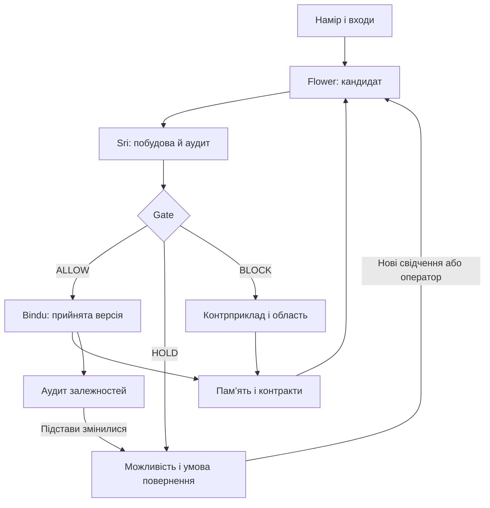

# 01 — Стан і архітектура переходів

[План читання](README.md)

## Стан

```math
S_t=(X_t,O_t,M_t).
```

X — поточні дані та обмеження; O — обрана операція або орієнтація пошуку; M — історія, перевірені контракти, конфлікти й залежності. Три компоненти не означають фізичний тривимірний простір.

Два однакові X можуть мати різні продовження, якщо відрізняються чинні свідчення, доступні оператори або історія невдалих спроб. Це не змінює математичної істини, але змінює доступний системі пошук.

```math
\mathcal A_t=\operatorname{Eligible}(X_t,M_t,\mathcal C_t),
\qquad O_t=\operatorname{Select}(\mathcal A_t,X_t,M_t).
```

```math
\widehat X_{t+1}=f_{O_t}(X_t),
\qquad V_t=\operatorname{Audit}(X_t,O_t,\widehat X_{t+1},M_t).
```

Нова версія прийнятого стану виникає тільки після ALLOW. Історія поповнюється також для HOLD та BLOCK.

## Цикл



Паралельно потрібні дані задачі, граф операцій та граф свідчень. Це різні типи ребер. Намальований перетин ліній сам не створює залежності.

## Дев’ять ролей Sri

| Роль | Відповідальність |
|---|---|
| T1 Activation | Намір та критерій завершення |
| T2 Receiver | Типи, джерела, одиниці й версії входів |
| T3 Direction | Ціль і міра прогресу |
| T4 Structure | Кандидат операції або нового представлення |
| T5 Boundary | Передумови, область визначення й межі |
| T6 Balance | Інваріанти й узгодженість залежностей |
| T7 Memory | Походження, свідчення та відновлюваність маршруту |
| T8 Shadow | Збір конкретних провалів і невідомого |
| T9 Repair / Return | Виправлення або наступний цикл |

Ролі не вимагають дев’яти агентів чи послідовних викликів. Згода кількох перевірок не означає їхню незалежність.

## +3 / −3

| Прохід | Кроки |
|---|---|
| +3: побудова | Зафіксувати кандидат → розгорнути альтернативи → побудувати типізований перехід |
| −3: перевірка | Зібрати Shadow → перевірити інваріанти й lift → повернути перевірений результат до Bindu або залишити HOLD/BLOCK |

Це організація процесу; код експериментів не містить універсального шеститактного scheduler. Зворотний аудит необоротної операції використовує свідчення, а не удавану точну інверсію.

## Трикутник, двері й шари

```math
T=(\mathrm{inputs},\mathrm{operation},\mathrm{outputs},
\mathrm{pre},\mathrm{post},\mathrm{evidence}).
```

Розтягування трикутника — деталізація модуля в підграф зі збереженням його зовнішнього контракту. Наприклад, множення й віднімання отримують власні входи, виходи та перевірки.

| Зображення | Проєктне прочитання | Статус |
|---|---|---|
| Чотири зовнішні ворота | Вхід, перебудова, свідчення, наслідки | Інтерфейс контрактів |
| 14 | Широкий простір кандидатів | Не фіксована кількість кандидатів у коді |
| Перше 10 | Структурування представлення | Не десять обов’язкових операцій |
| Друге 10 | Узгодження й перевірки | Не доведений коефіцієнт стиснення |
| 8 | Збереження інваріантів | Не фізичні стани речовини |
| Центральний трикутник і Bindu | Підготовка й фіксація локального рішення | ALLOW тільки у перевіреній області |

Не ототожнювати ролі T1–T9, шари 14/10/10/8, чотири ворота й дев’ять арифметичних добутків. Вони мають різні функції.

Далі: [02 — Gate і Pandora](02_GATE_AND_PANDORA.md).
