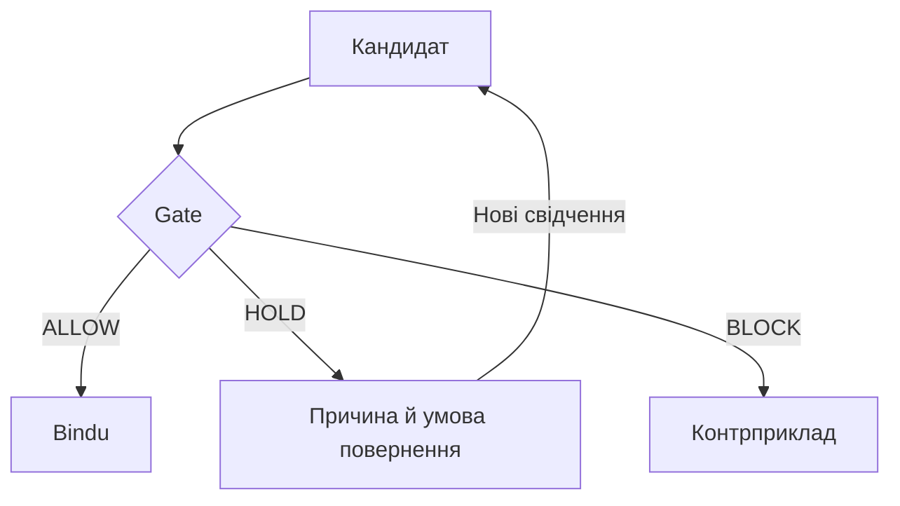

# 08 — Формули, значки й діаграми GitHub

[План читання](README.md)

Перевірено за офіційними правилами GitHub 2026-09-16. Статична перевірка пакета не є переглядом уже опублікованої сторінки GitHub.

## Формули

У цьому пакеті великі формули записано в блоках `math`. GitHub підтримує їх без додаткових доларових роздільників. Короткі формули в тексті можна обрамляти одинарними доларами. [Офіційні правила](https://docs.github.com/en/get-started/writing-on-github/working-with-advanced-formatting/writing-mathematical-expressions).

Зразок вихідного Markdown:

````markdown
```math
F_i=C\cup P_i.
```
````

Очікувана формула:

```math
F_i=C\cup P_i.
```

Словами: множина F_i складається з ядра C та пелюстки P_i.

Для наступних формул дотримуйся того самого формату:

```math
\boxed{Z(C,U,A)=\{F\in\mathcal F\setminus A:
C\subseteq F\land(F\setminus C)\cap U=\varnothing\}}.
```

```math
W_{ij}=\begin{cases}
0,&i=j,\\
|P_i\cap P_j|,&i\ne j.
\end{cases}
```

Якщо читач бачить команди `\cup` чи `\boxed` замість символів, перевір, що він відкрив відрендерений Markdown, а не raw-текст або сторонній переглядач без підтримки математики.

## Чого уникати

- Не використовуй звичайні квадратні дужки як обрамлення математичного блоку.
- Не став рядок із `=` або `---` під математичним текстом поза блоком: Markdown може сприйняти це як заголовок або розділювач.
- Не загортай цілий `.md` файл у зовнішній блок коду при завантаженні.
- Не став доларові роздільники всередині блоку `math`.
- У самому `.md` перед LaTeX-командою потрібна одна зворотна риска. Подвійне екранування потрібне лише в деяких форматах транспорту, наприклад JSON.
- Не перенось багаторядкові формули в клітинки таблиці; тримай таблиці короткими.

Це пояснює можливі причини симптомів на скриншотах; точний початковий файл там не перевірявся. Сирий текст в іншому застосунку не означає, що GitHub покаже його так само.

## Значки й статуси

| Значок | Текстовий статус | Значення |
|---|---|---|
| ✓ | ALLOW | Умови підтверджено в зазначеній області |
| … | HOLD | Потрібні свідчення або продовження пошуку |
| ✕ | BLOCK | Конкретну умову спростовано |
| ↻ | RECHECK | Переоцінка після зміни підстав |

Файл зберігається в UTF-8. Текстові статуси залишаються обов’язковими: колір або вигляд значка може відрізнятися між пристроями. RECHECK тут дія інтерфейсу, а не четверте логічне рішення Gate.

## Mermaid

GitHub підтримує діаграми в блоках із мовою `mermaid`. [Офіційні правила](https://docs.github.com/en/get-started/writing-on-github/working-with-advanced-formatting/creating-diagrams).



Використано прості flowchart-елементи. У складніших майбутніх діаграмах перевіряй підтримку синтаксису поточною версією Mermaid на GitHub.

## Посилання й заголовки

Внутрішні посилання відносні до поточного файлу. Назви файлів у цьому пакеті без пробілів, із точним регістром. Порожні рядки відокремлюють абзаци, таблиці, списки та блоки. [Правила Markdown і відносних посилань](https://docs.github.com/en/get-started/writing-on-github/getting-started-with-writing-and-formatting-on-github/basic-writing-and-formatting-syntax).

Після додавання папки відкрий цей файл у GitHub Preview: перевір формулу з об’єднанням, визначення Z, матрицю W, таблицю статусів і схему. Це короткий контрольний документ для реального рендерера.
